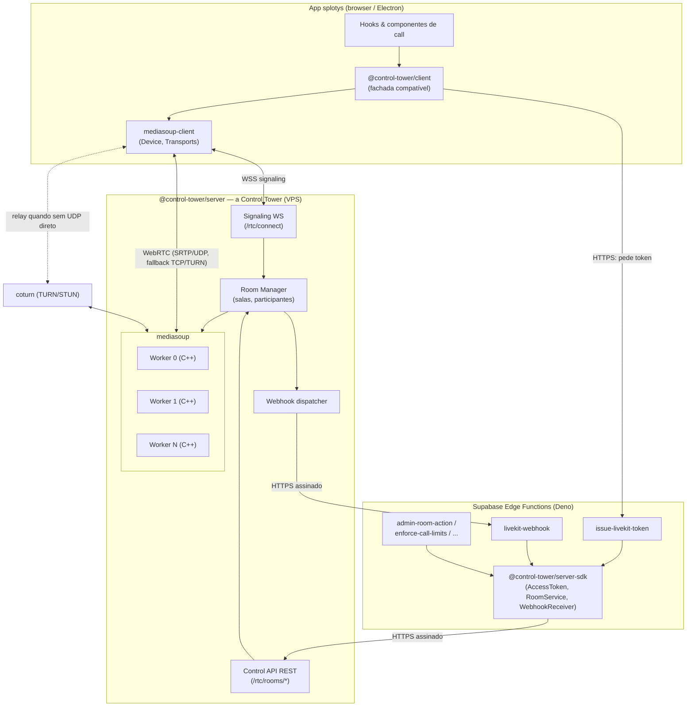
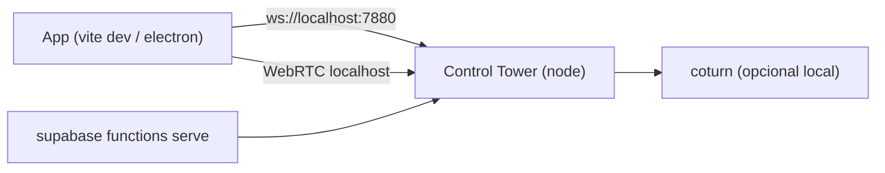
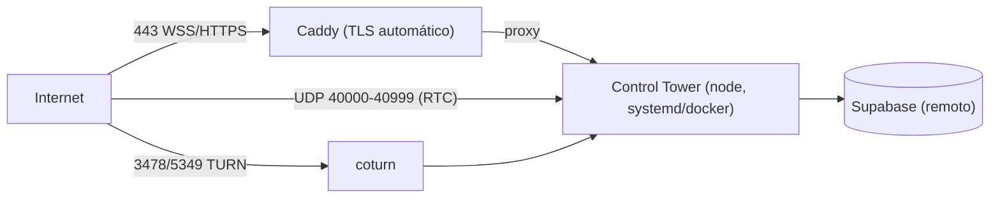

# 02 — Arquitetura

## Visão de componentes



### Papéis

- **`@control-tower/client`**: expõe `Room`, `RoomEvent`, `Track`, etc. (fachada). Internamente
  usa `mediasoup-client` para negociar WebRTC e o nosso protocolo WS para signaling.
- **`@control-tower/server` (Control Tower)**: processo Node único com:
  - **Signaling WS** (`/rtc/connect`): valida token, faz o handshake, roteia requisições.
  - **Room Manager**: mantém salas em memória; cada sala tem 1 `Router` mediasoup num worker.
  - **Control API REST** (`/rtc/rooms/*`): endpoints administrativos consumidos pelo server-sdk.
  - **Webhook dispatcher**: envia eventos assinados às Edge Functions.
  - **mediasoup workers**: 1 por núcleo; onde a mídia realmente trafega.
- **`@control-tower/server-sdk`**: usado nas Edge Functions; só faz JWT (Web Crypto) e HTTP (`fetch`).
- **coturn**: TURN/STUN para quando o cliente não consegue UDP direto (NAT restrito, redes corporativas).

## Fluxo de dados (uma call típica)

1. App chama Edge `issue-livekit-token` → recebe `{ serverUrl, participantToken }`.
2. App chama `room.connect(serverUrl, token)`.
3. SDK abre `wss://media.splotys.com/rtc/connect?access_token=<jwt>`.
4. Control Tower valida o JWT, cria/entra na sala (Router no worker), responde `welcome` com
   RTP capabilities, ICE servers e lista de participantes/producers existentes.
5. SDK carrega o `Device`, cria transports `send` e `recv`, faz `connectTransport`.
6. App habilita mic → SDK captura `getUserMedia` → `produce` → Control Tower cria Producer →
   notifica os outros com `newProducer`.
7. Outros SDKs recebem `newProducer` → pedem `consume` → renderizam áudio/vídeo.
8. Control Tower emite webhooks (`room_started`, `participant_joined`, `track_published`, ...) às Edge.
9. Guardrails/admin usam Control API via server-sdk (`listParticipants`, `removeParticipant`, ...).

## Topologia de deploy

### Local (desenvolvimento e testes)

Tudo em uma máquina via `docker compose` (ver doc 08 para o arquivo completo):



- Sem TLS no local: signaling em `ws://127.0.0.1:7880`, WebRTC via `127.0.0.1` (announcedIp=127.0.0.1).
- mediasoup `rtcMinPort`/`rtcMaxPort` numa faixa pequena (ex.: 40000–40100) para caber no compose.
- coturn é opcional no local (conexões diretas a localhost sempre funcionam); incluir para testar o caminho TURN.

### VPS (produção)

Um host (Hostinger KVM 2 como referência):



- **Caddy** termina TLS e faz proxy de `wss://media.<domínio>/rtc/*` e `https://media.<domínio>/rtc/rooms/*` para a Control Tower (porta interna 7880).
- **mediasoup** anuncia o IPv4 público (`announcedIp`) e usa a faixa UDP 40000–40999.
- **coturn** em `turn.<domínio>` para relay.
- A Control Tower não hospeda banco; usa o Supabase existente indiretamente (via Edge Functions e webhooks). A Control Tower em si é **stateless em disco** (estado das salas é em memória; a verdade durável é o Postgres via webhooks).

## Monorepo — layout de arquivos

**Decidido** (Spec 002, Q-01/Q-02/Q-03): **repositório GitHub privado próprio `control-tower`**,
apartado do app splotys, com workspaces npm. Os pacotes `@control-tower/client`,
`@control-tower/server-sdk` e `@control-tower/protocol` são **publicados no npm** (começando
públicos — build sem segredos); o app instala `@control-tower/client` normalmente e as Edge
Functions importam `npm:@control-tower/server-sdk@<versão>` (mesmo mecanismo do
`npm:livekit-server-sdk` atual). `@control-tower/server` (a torre) **não** é pacote npm — vai
como imagem Docker no VPS.

```
control-tower/
  package.json                # workspaces
  tsconfig.base.json
  packages/
    protocol/                 # @control-tower/protocol
      src/
        envelope.ts           # tipos de envelope (req/res/notify)
        messages.ts           # todos os payloads (ver doc 03)
        errors.ts             # códigos de erro
        index.ts
    server/                   # @control-tower/server (a Control Tower)
      src/
        index.ts              # bootstrap (http + ws + workers)
        config.ts             # env vars, portas, faixas
        workers.ts            # pool de workers mediasoup
        room.ts               # classe Room (router, peers, producers)
        room-manager.ts       # registro de salas em memória
        peer.ts               # estado por conexão (transports, producers, consumers)
        signaling.ts          # servidor WS e roteamento de mensagens
        handlers/             # um arquivo por método do protocolo
        control-api.ts        # REST /rtc/rooms/*
        webhooks.ts           # dispatcher assinado
        auth.ts               # verificação de JWT de participante e de admin
        audio-observer.ts     # active speakers
        data.ts               # DataProducer/DataConsumer (chat/sistema)
        logging.ts, metrics.ts
      Dockerfile
    client/                   # @control-tower/client
      src/
        room.ts               # fachada Room
        room-event.ts         # enum RoomEvent (nomes iguais aos do livekit-client)
        participant.ts        # LocalParticipant / RemoteParticipant
        track.ts              # Track, Track.Source, Local/RemoteAudio/VideoTrack, publication
        presets.ts            # VideoPreset, AudioPresets
        signaling.ts          # cliente WS do protocolo
        transport.ts          # wrapper de mediasoup-client Device/Transports
        data-streams.ts       # sendText/sendFile + handlers (protocolo de stream)
        index.ts              # re-exporta a superfície compatível
    server-sdk/               # @control-tower/server-sdk (Deno-compatível)
      src/
        access-token.ts       # AccessToken + TrackSource
        room-service.ts       # RoomServiceClient (HTTP)
        webhook-receiver.ts   # WebhookReceiver
        jwt.ts                # HS256 via Web Crypto
        index.ts
  deploy/
    docker-compose.local.yml
    docker-compose.vps.yml
    Caddyfile
    coturn/turnserver.conf
  test/
    load/                     # scripts de teste de carga (ver doc 10)
    e2e/
```

## Escolhas técnicas fixas

| Decisão | Escolha | Motivo |
| --- | --- | --- |
| Linguagem servidor | TypeScript (Node ≥ 20) | Mesmo stack do app; mediasoup é Node. |
| SFU | mediasoup ≥ 3.x | Media plane em C++ nativo, maduro, por-core. |
| Signaling | WebSocket + JSON (envelope req/res/notify) | Simples para agente implementar e depurar. |
| Cliente WebRTC | mediasoup-client | Casa 1:1 com o servidor mediasoup. |
| Transporte de dados | SCTP DataChannel via mediasoup | Necessário para chat/sistema e semântica reliable. |
| TLS | Caddy (auto) | Zero-config de certificados no VPS. |
| TURN | coturn | Padrão de mercado; o roadmap já prevê portas. |
| JWT | HS256 (Web Crypto no Deno; jsonwebtoken/jose no Node) | Compatível com Deno e simétrico (temos o secret nos dois lados). |
| Estado das salas | Em memória (Control Tower) + Postgres (via webhook) | Control Tower stateless em disco; DB é a verdade durável. |

## Portas (resumo; detalhe no doc 08)

| Porta | Proto | Uso |
| --- | --- | --- |
| 7880 | TCP | Control Tower HTTP/WS interno (atrás do Caddy no VPS; direto no local) |
| 443 | TCP | Caddy: WSS signaling + HTTPS control API (VPS) |
| 40000–40999 | UDP | Mídia WebRTC (mediasoup) |
| 7881 | TCP | Mídia WebRTC sobre TCP (fallback direto) |
| 3478 | UDP/TCP | TURN/STUN (coturn) |
| 5349 | TCP | TURN sobre TLS (coturn) |
