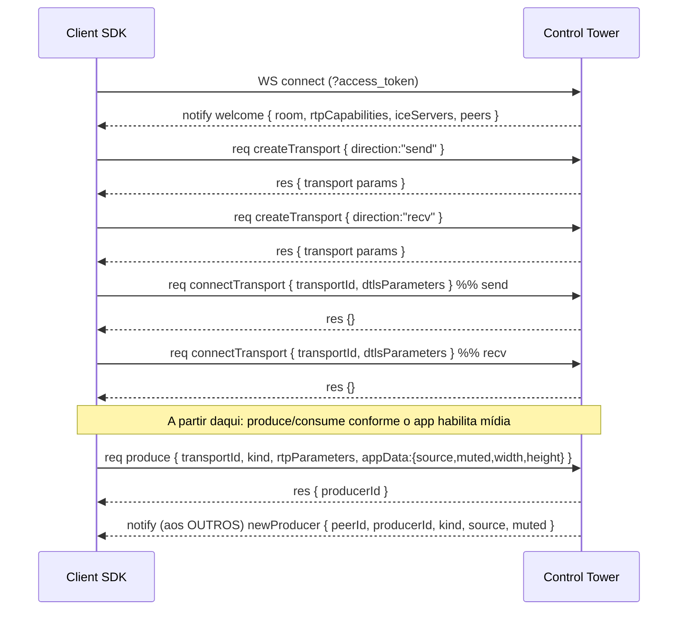

# 03 — Protocolo de signaling

Este é o contrato entre `@control-tower/client` e `@control-tower/server`. É a **fonte da
verdade**: implemente exatamente estes formatos. Todos os tipos vivem em
`@control-tower/protocol`. Transporte: **WebSocket**, mensagens **JSON UTF-8**.

## Conexão

```
wss://media.<domínio>/rtc/connect?access_token=<jwt>&protocol=1
```

- `access_token`: JWT de participante (ver doc 07). Validado antes de aceitar o WS.
- `protocol`: versão do protocolo (inteiro). Inicial: `1`. Se incompatível, servidor fecha
  com close code `4400` e razão `PROTOCOL_UNSUPPORTED`.
- Se o token for inválido/expirado: fecha com `4401` / `UNAUTHORIZED` antes de qualquer mensagem.

Heartbeat: ping/pong nativo do WebSocket a cada 15 s; se 2 pings ficarem sem pong, o lado
considera a conexão morta. O cliente tenta reconectar (ver §Reconexão).

## Envelope

Toda mensagem é um dos três tipos:

```ts
// Requisição (cliente→servidor ou servidor→cliente) que espera resposta
interface Req<M extends string, D> { t: 'req'; id: string; method: M; data: D }

// Resposta a uma Req, correlacionada por id
interface Res<D> { t: 'res'; id: string; ok: true; data: D }
interface ResErr { t: 'res'; id: string; ok: false; error: { code: string; message?: string } }

// Notificação unidirecional (sem resposta)
interface Notify<M extends string, D> { t: 'notify'; method: M; data: D }
```

- `id`: UUID v4 gerado por quem emite a `Req`. A `Res` ecoa o mesmo `id`.
- Timeout de request: 15 s. Sem resposta → o lado emissor rejeita a Promise com `TIMEOUT`.
- Requests podem fluir nos dois sentidos (o servidor também faz `req` ao cliente, ex.: `ping`
  de aplicação não é necessário porque usamos ping WS; mas mantenha o modelo bidirecional).

## Sequência de handshake



## Mensagens servidor→cliente (notify)

### `welcome`
Primeira mensagem após conectar.
```ts
{
  self: { id: string; identity: string; name: string; metadata: string; grant: Grant },
  room: { name: string; sid: string },
  rtpCapabilities: RtpCapabilities,        // do Router mediasoup
  iceServers: IceServer[],                 // STUN/TURN (ver doc 07)
  peers: PeerSnapshot[]                     // participantes já na sala + seus producers
}

interface PeerSnapshot {
  id: string; identity: string; name: string; metadata: string;
  producers: { producerId: string; kind: 'audio'|'video'; source: TrackSource; muted: boolean;
               width?: number; height?: number }[]
}
type TrackSource = 'microphone' | 'camera' | 'screen_share' | 'screen_share_audio'
interface Grant { canPublish: boolean; canSubscribe: boolean; canPublishData: boolean;
                  canPublishSources: TrackSource[] }
```

### `newProducer`
Um peer publicou uma faixa.
```ts
{ peerId: string; producerId: string; kind: 'audio'|'video'; source: TrackSource;
  muted: boolean; width?: number; height?: number }
```
→ cliente decide assinar (chama `consume`).

### `producerClosed`
```ts
{ peerId: string; producerId: string }
```
→ cliente fecha o consumer correspondente; emite `TrackUnpublished`/`TrackUnsubscribed`.

### `producerPaused` / `producerResumed`
```ts
{ peerId: string; producerId: string }
```
→ mapeiam para `TrackMuted` / `TrackUnmuted`.

### `peerJoined` / `peerLeft`
```ts
// peerJoined
{ id: string; identity: string; name: string; metadata: string }
// peerLeft
{ id: string }
```
→ `ParticipantConnected` / `ParticipantDisconnected`.

### `peerUpdated`
Mudança de nome/metadata.
```ts
{ id: string; name?: string; metadata?: string }
```
→ `ParticipantNameChanged` / `ParticipantMetadataChanged`.

### `activeSpeakers`
Do AudioLevelObserver (ver doc 04). Enviado com debounce.
```ts
{ speakers: { peerId: string; level: number }[] }   // level: dBov normalizado 0..1
```
→ `ActiveSpeakersChanged`.

### `consumerClosed` / `consumerPaused` / `consumerResumed`
```ts
{ consumerId: string }
```
Quando o servidor precisa encerrar/pausar um consumer (ex.: producer sumiu, dynacast).

### `systemData`
Dados originados no **servidor** (RoomService.sendData). Entregue via DataConsumer, mas o
SDK também expõe como evento `DataReceived` com o `topic`.
```ts
{ topic: string; payload: string /* base64 */ ; kind: 'reliable'|'lossy' }
```

### `roomClosed`
```ts
{ reason: string }   // ex.: 'deleted', 'max_duration', 'server_shutdown'
```
→ cliente desconecta; `Disconnected`.

## Mensagens cliente→servidor (req → res)

### `createTransport`
```ts
// req.data
{ direction: 'send' | 'recv' }
// res.data — parâmetros do WebRtcTransport mediasoup
{ id: string; iceParameters: IceParameters; iceCandidates: IceCandidate[];
  dtlsParameters: DtlsParameters; sctpParameters?: SctpParameters }
```

### `connectTransport`
```ts
// req.data
{ transportId: string; dtlsParameters: DtlsParameters }
// res.data
{}
```

### `produce`
Publica uma faixa. `source` distingue mic/câmera/tela.
```ts
// req.data
{ transportId: string;          // deve ser o transport 'send'
  kind: 'audio'|'video';
  rtpParameters: RtpParameters;
  appData: { source: TrackSource; muted?: boolean; width?: number; height?: number } }
// res.data
{ producerId: string }
```
Regras de autorização: o `source` precisa estar em `grant.canPublishSources`, senão
`res.ok=false` com `FORBIDDEN_SOURCE`. `width/height` (vídeo) são guardados para o webhook.

### `closeProducer`
```ts
// req.data
{ producerId: string }
// res.data { }
```
→ servidor emite `producerClosed` aos demais.

### `pauseProducer` / `resumeProducer`
Mute/unmute (o app chama isso ao mutar mic/câmera; mantemos a faixa publicada e só pausamos).
```ts
{ producerId: string } → {}
```
→ servidor emite `producerPaused`/`producerResumed`.

### `consume`
Assina um producer remoto.
```ts
// req.data
{ transportId: string;          // o transport 'recv'
  producerId: string;
  rtpCapabilities: RtpCapabilities }
// res.data
{ consumerId: string; producerId: string; kind: 'audio'|'video';
  rtpParameters: RtpParameters; producerPaused: boolean }
```
Servidor cria o Consumer **pausado** (padrão mediasoup). Cliente chama `resumeConsumer`
após anexar. Se `rtpCapabilities` não puderem consumir, retorna `CANNOT_CONSUME`.

### `resumeConsumer` / `pauseConsumer`
```ts
{ consumerId: string } → {}
```

### `setConsumerPreferredLayers`
adaptiveStream: cliente pede camada espacial/temporal menor quando o vídeo está pequeno/oculto.
```ts
{ consumerId: string; spatialLayer: number; temporalLayer?: number } → {}
```

### `updatePeer`
Cliente atualiza o próprio nome/metadata (raro no app atual, mas manter).
```ts
{ name?: string; metadata?: string } → {}
```
→ servidor propaga `peerUpdated`.

### `restartIce`
Reconexão de rede.
```ts
{ transportId: string } → { iceParameters: IceParameters }
```

### Data streams (chat) — ver doc 05 §"Data streams"
O chat usa **DataChannel SCTP** com um protocolo de stream próprio por cima
(`produceData`/`consumeData` + framing de chunks). Requests:

#### `produceData`
```ts
{ transportId: string; sctpStreamParameters: SctpStreamParameters;
  label: string; protocol: string; appData: { topic: string } } → { dataProducerId: string }
```
#### `consumeData`
```ts
{ transportId: string; dataProducerId: string } → { dataConsumerId: string;
  sctpStreamParameters: SctpStreamParameters; label: string; protocol: string;
  appData: { topic: string } }
```
O servidor notifica `newDataProducer { peerId, dataProducerId, topic }` para os demais,
espelhando `newProducer`.

## Códigos de erro (em `res.error.code`)

| Código | Quando |
| --- | --- |
| `UNAUTHORIZED` | Token inválido/expirado |
| `PROTOCOL_UNSUPPORTED` | Versão de protocolo incompatível |
| `FORBIDDEN_SOURCE` | `produce` de fonte fora do grant |
| `NOT_ALLOWED_PUBLISH` | `canPublish=false` |
| `NOT_ALLOWED_SUBSCRIBE` | `canSubscribe=false` |
| `CANNOT_CONSUME` | rtpCapabilities incompatíveis |
| `TRANSPORT_NOT_FOUND` | transportId desconhecido |
| `PRODUCER_NOT_FOUND` / `CONSUMER_NOT_FOUND` | id desconhecido |
| `ROOM_CLOSED` | sala já encerrada |
| `RATE_LIMITED` | excesso de requests |
| `INTERNAL` | erro inesperado do servidor |
| `TIMEOUT` | (lado cliente) sem resposta em 15 s |

## Reconexão

- WS caiu mas o token ainda é válido: o cliente reconecta ao mesmo `/rtc/connect`.
- O servidor mantém o estado do peer por um **grace period** (padrão 15 s) associado à
  `identity`; se o mesmo participante reconectar dentro da janela, reanexa producers/consumers
  via `restartIce` em vez de recriar tudo. Passou o grace → o peer é considerado saído
  (`peerLeft`, webhook `participant_left`).
- Estados expostos ao app: `Reconnecting` (renegociando ICE) e `SignalReconnecting`
  (reabrindo o WS). Ver mapeamento no doc 05.

## Versionamento

`protocol=1` é imutável depois de publicado. Mudanças incompatíveis incrementam o número.
A Control Tower pode suportar N versões simultâneas por um tempo durante migrações. Campos novos
opcionais **não** exigem bump; remoção/renome de campo exige.
