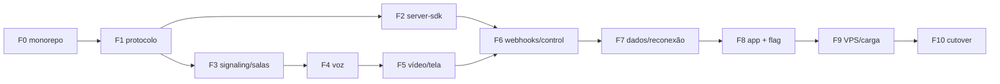

# 12 — Marcos de implementação (para o agente executor)

Sequência incremental. **Não pule fases.** Cada fase tem uma Definition of Done (DoD)
verificável. Só avance quando a DoD passar. Tudo roda **localmente** até a Fase 8.

Convenção: "✅ DoD" = critério objetivo de conclusão. "🔗" = documento de referência.

---

## Fase 0 — Fundações do monorepo
- Criar o repo/monorepo `control-tower` com workspaces e os 4 pacotes vazios (🔗 02 §monorepo).
- `tsconfig.base.json`, lint, formatação, scripts `build`/`test` por pacote.
- **✅ DoD**: `npm install` e `npm run build` passam em todos os pacotes (mesmo que exportem só stubs).

## Fase 1 — Protocolo (`protocol`)
- Implementar todos os tipos de envelope e mensagens do 🔗 03 (welcome, newProducer, produce,
  consume, connectTransport, etc.) e os códigos de erro.
- Validadores (zod ou checagem manual) para cada payload.
- **✅ DoD**: testes de unidade de serialização/validação passam (🔗 10 §Nível 1). Nenhum outro
  pacote precisa estar pronto.

## Fase 2 — SDK servidor (`server-sdk`) + troca do seam
- Implementar `jwt.ts` (HS256 Web Crypto), `AccessToken`, `TrackSource`, `WebhookReceiver`,
  `RoomServiceClient` (🔗 06).
- **✅ DoD**:
  - `deno test` verde (token válido/ inválido, webhook aceita/rejeita, RoomService monta
    requests certos, `state` mapeado). 🔗 10 §Nível 1.
  - Um token gerado aqui é aceito pela função de auth da Control Tower (teste cruzado — pode usar um
    stub de `verify` copiado até a Control Tower existir).
  - Trocar o import em `_shared/livekit.ts` **num branch**; `supabase functions` compila.

## Fase 3 — Control Tower: signaling + salas (sem mídia ainda)
- `workers.ts` (pool), `room-manager.ts`, `room.ts` (router + peers), `peer.ts`,
  `signaling.ts` + `auth.ts`, `handlers/` para: createTransport, connectTransport (aceitar e
  responder), updatePeer, e o `welcome`.
- Control API `control-api.ts` com `listParticipants` e `deleteRoom` (os outros na Fase 6).
- **✅ DoD**: teste de integração de protocolo (🔗 10 §Nível 2): conectar com token válido →
  `welcome`; token inválido → close 4401; dois peers se veem via `peerJoined`.

## Fase 4 — Control Tower + cliente: mídia básica (voz)
- `client`: `Room.connect` completo (device, transports), `setMicrophoneEnabled`
  (produce áudio), auto-subscribe (consume), `RemoteAudioTrack.attach/setVolume/setSinkId`.
- Control Tower: handlers `produce`/`consume`/`resumeConsumer`/`pauseProducer`/`resumeProducer`/
  `closeProducer`; broadcast de `newProducer`/`producerClosed`/`producerPaused`.
- **✅ DoD**: com `docker compose up torre` local, **dois navegadores** entram numa sala de
  teste (página mínima usando só o `client`, sem o app inteiro) e **um ouve o outro**.
  Mute/unmute reflete em `TrackMuted/Unmuted`. 🔗 10 §Nível 3 (linhas de voz).

## Fase 5 — Vídeo, tela e áudio de tela + presets
- `setCameraEnabled`, `setScreenShareEnabled` (com simulcast e áudio de tela), `VideoPreset`,
  `AudioPresets`, `RemoteVideoTrack/LocalVideoTrack.attach`.
- Control Tower: guardar `width/height` no `produce` e no `track_published`; codecs VP8/H264/Opus.
- **✅ DoD**: dois navegadores trocam câmera e tela (com áudio da tela); presets 720p/1080p
  aplicados (conferir stats). 🔗 10 §Nível 3 (câmera/tela/qualidade).

## Fase 6 — Webhooks + Control API completa + active speakers
- Control Tower: `webhooks.ts` (6 eventos assinados, retry, idempotência) apontando para a Edge local;
  `audio-observer.ts` (active speakers); Control API restante
  (`removeParticipant`, `updateParticipant`, `sendData`).
- **✅ DoD**:
  - Rodando `supabase functions serve` local, os 6 webhooks chegam e populam
    `room_sessions`/`participant_sessions` como o LiveKit fazia. 🔗 10 (webhooks).
  - `enforce-call-limits` local consegue `listParticipants`/`sendData`/`removeParticipant`/
    `deleteRoom` contra a Control Tower.
  - Enforce de resolução: tela grande → bloqueio via `updateParticipant`.
  - `ActiveSpeakersChanged` dispara ao falar.

## Fase 7 — Data streams (chat) + mensagens de sistema + reconexão
- `client`: `sendText`/`sendFile`, `registerTextStreamHandler`/`registerByteStreamHandler`,
  `reader.info`/`readAll`, `DataReceived` para `systemData` (🔗 05 §data streams).
- Control Tower: DataProducer/DataConsumer + DirectTransport para `sendData` do servidor; grace period
  e `restartIce` para reconexão.
- **✅ DoD**: chat texto e imagem (≤4 MB) funcionam entre dois navegadores; mensagem de sistema
  `system.call-limit` chega via `DataReceived`; derrubar a rede 5 s reconecta sem recriar a sala.
  🔗 10 §Nível 3 (chat/reconexão).

## Fase 8 — Integração real no app (atrás de flag)
- Trocar os imports no frontend (🔗 11 §seams) para `@control-tower/client`.
- `issue-livekit-token` retorna `serverUrl` da Control Tower quando `RTC_PROVIDER=torre` (canary por sala).
- Rodar a **matriz completa** do 🔗 10 §Nível 3 dentro do app real, local.
- **✅ DoD**: toda a matriz do Nível 3 passa **no app splotys real**, localmente, sem regressão
  perceptível vs LiveKit.

## Fase 9 — VPS + carga
- Provisionar VPS, DNS, Caddy (TLS), coturn, firewall (🔗 08). `GET /healthz` verde por HTTPS.
- Observabilidade (🔗 09): logs JSON, `/metrics`, alerta de CPU.
- Rodar carga 3/5/8 por ≥ 1 semana (🔗 10 §Nível 4).
- **✅ DoD**: 1–2 calls simultâneas com voz + 1 tela 720p estáveis, CPU < 85% sustentado, sem
  perda audível, por ≥ 1 semana. Métricas coletadas.

## Fase 10 — Cutover
- Seguir 🔗 11 §sequência: canary → cutover total → manter LiveKit quente → descomissionar.
- **✅ DoD**: 100% das salas na Control Tower, LiveKit desligado, PR de limpeza (env `RTC_*`, remover
  libs livekit) mergeado, rollback testado e documentado.

---

## Ordem de dependência (resumo visual)

## Regras para o executor
- Sempre validar a DoD da fase atual **antes** de começar a próxima.
- Se um método/evento do 🔗 01 §A não estiver claro, **abrir o arquivo do app** citado e
  espelhar o comportamento observado — o app é a especificação final do que a fachada precisa.
- Nunca "melhorar" a superfície pública do `client`/`server-sdk`: ela precisa **igualar**
  o LiveKit, não superá-lo. Extras vão em métodos novos, nunca alterando os existentes.
- Commits pequenos por fase; testes junto do código.
