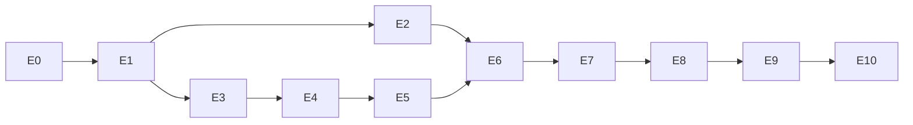

# Spec 002 — Plano de implementação

Plano de execução em **estágios com entregas testáveis**. Cada estágio: objetivo, decisões que
o bloqueiam (de [`open-questions.md`](open-questions.md)), entregáveis concretos, passos, e um
**gate de saída** verificável. Só avance quando o gate estiver verde. O "como" detalhado está em
[`plans/rtc/`](../../plans/rtc/README.md) — este plano referencia, não duplica.

> Antes de cada estágio: leia [`tracking.md`](tracking.md) (estado) e cheque decisões `OPEN` que
> bloqueiam. Regra R2 do contrato: indefinição vira pergunta, nunca suposição.

Legenda de gate: `[ ]` pendente · `[x]` feito. O status real por estágio fica em `tracking.md`.

---

## E0 — Fundações do monorepo
**Objetivo:** esqueleto do projeto compilando. **Bloqueado por:** Q-01, Q-02. 🔗 [plan 02 §monorepo](../../plans/rtc/02-architecture.md)

**Entregáveis:**
- Estrutura de workspaces com os 4 pacotes: `protocol`, `server`, `client`, `server-sdk` (stubs que exportam vazio).
- `tsconfig.base.json`, lint/format, scripts `build`/`test` por pacote.
- CI mínimo (build + test) rodando.

**Gate de saída:**
- [ ] `npm install` e `npm run build` passam em todos os pacotes.
- [ ] `npm test` roda (mesmo sem testes ainda) sem erro de configuração.
- [ ] CI verde no primeiro commit.

---

## E1 — `protocol`
**Objetivo:** contratos de mensagem prontos e validados. **Bloqueado por:** — . 🔗 [plan 03](../../plans/rtc/03-protocol.md)

**Entregáveis:**
- Tipos de envelope (`Req`/`Res`/`ResErr`/`Notify`) e **todas** as mensagens do plano 03
  (welcome, newProducer, produce, consume, connectTransport, createTransport, closeProducer,
  pause/resumeProducer, resume/pauseConsumer, setConsumerPreferredLayers, updatePeer, restartIce,
  produceData, consumeData, systemData, peerJoined/Left/Updated, activeSpeakers, roomClosed, ...).
- Códigos de erro do plano 03.
- Validadores por payload.

**Gate de saída:**
- [x] Teste de unidade: cada mensagem serializa/parse e rejeita payload malformado. 🔗 [plan 10 §Nível 1](../../plans/rtc/10-testing-plan.md)
- [x] Nenhum outro pacote precisa existir para os testes passarem.

---

## E2 — `server-sdk` + troca do seam
**Objetivo:** emissão de token, webhook receiver e RoomService, prontos para Deno.
**Bloqueado por:** Q-03. 🔗 [plan 06](../../plans/rtc/06-server-sdk.md), [plan 07](../../plans/rtc/07-security-auth.md)

**Entregáveis:**
- `jwt.ts` (HS256 via Web Crypto), `AccessToken` + `TrackSource`, `WebhookReceiver`, `RoomServiceClient`.
- Branch trocando o import em `_shared/livekit.ts` e `livekit-webhook/index.ts` para o novo pacote (sem mudar lógica).

**Gate de saída:**
- [ ] `deno test`: token válido/inválido/expirado; webhook aceita corpo assinado e rejeita adulterado; RoomService monta URLs/corpos certos; `state` mapeado (3 = desconectado). 🔗 [plan 10 §Nível 1](../../plans/rtc/10-testing-plan.md)
- [ ] Teste cruzado: token gerado aqui é aceito pela lógica de auth da Control Tower (mesmo secret).
- [ ] `supabase functions` compila com o import trocado.
- [ ] Identity `usr_..._...` e room `DT_...` preservados no token.

---

## E3 — Control Tower: signaling e salas (sem mídia)
**Objetivo:** handshake e presença funcionando, sem mídia ainda. **Bloqueado por:** — . 🔗 [plan 04](../../plans/rtc/04-media-server.md)

**Entregáveis:**
- `workers.ts` (pool), `room-manager.ts`, `room.ts` (router + peers), `peer.ts`, `signaling.ts`, `auth.ts`.
- Handlers: `createTransport`, `connectTransport`, `updatePeer`, e emissão do `welcome`.
- Control API inicial: `listParticipants`, `deleteRoom`.
- `GET /healthz`.

**Gate de saída:** 🔗 [plan 10 §Nível 2](../../plans/rtc/10-testing-plan.md)
- [ ] Conectar com token válido → recebe `welcome`; token inválido → close `4401`.
- [ ] Dois peers na mesma sala: cada um recebe `peerJoined`/`peerLeft` do outro.
- [ ] `GET /healthz` reporta salas/peers.

---

## E4 — Voz ponta a ponta
**Objetivo:** dois navegadores, um ouve o outro. **Bloqueado por:** Q-07. 🔗 [plan 04](../../plans/rtc/04-media-server.md), [plan 05](../../plans/rtc/05-client-sdk.md)

**Entregáveis:**
- `client`: `Room.connect` completo (device + transports), `setMicrophoneEnabled` (produce áudio), auto-subscribe (consume), `RemoteAudioTrack.attach/detach/setVolume/setSinkId`, `RoomEvent`, `ConnectionState`, `Track.Source`.
- Control Tower: handlers `produce`/`consume`/`resumeConsumer`/`pauseProducer`/`resumeProducer`/`closeProducer`; broadcast de `newProducer`/`producerClosed`/`producerPaused`/`producerResumed`.
- Página mínima de teste usando só o `client` (sem o app inteiro).

**Gate de saída:** 🔗 [plan 10 §Nível 3](../../plans/rtc/10-testing-plan.md)
- [ ] `docker compose up torre` local; dois navegadores entram na sala de teste.
- [ ] B **ouve** A (áudio real tocando via `RemoteAudioRenderer`-like).
- [ ] Mute/unmute do mic reflete em `TrackMuted`/`TrackUnmuted` e o áudio cessa/volta.
- [ ] `produce` de fonte fora do grant → `FORBIDDEN_SOURCE`.

---

## E5 — Vídeo, tela e áudio de tela + presets
**Objetivo:** câmera e tela (com áudio) entre dois navegadores. **Bloqueado por:** Q-04, Q-05, Q-06, Q-07. 🔗 [plan 04](../../plans/rtc/04-media-server.md), [plan 05](../../plans/rtc/05-client-sdk.md)

**Entregáveis:**
- `setCameraEnabled`, `setScreenShareEnabled` (com áudio de tela e simulcast conforme decisão), `VideoPreset`, `AudioPresets`, `RemoteVideoTrack`/`LocalVideoTrack.attach`.
- Control Tower: guardar `width/height` no `produce` e propagar; codecs VP8/H264/Opus (conforme Q-06).

**Gate de saída:** 🔗 [plan 10 §Nível 3](../../plans/rtc/10-testing-plan.md)
- [ ] Dois navegadores trocam câmera (vídeo aparece/some nos dois lados).
- [ ] Compartilhar tela com áudio: o outro vê a tela e ouve o áudio da tela.
- [ ] Presets 720p/1080p aplicados (conferir por stats).
- [ ] `width/height` reais disponíveis no lado servidor (pré-requisito do HOOK-04 no E6).

---

## E6 — Webhooks + Control API completa + active speakers
**Objetivo:** estado durável no DB e moderação. **Bloqueado por:** — (usa Supabase local). 🔗 [plan 04](../../plans/rtc/04-media-server.md), [plan 06](../../plans/rtc/06-server-sdk.md), [plan 09](../../plans/rtc/09-observability-ops.md)

**Entregáveis:**
- Control Tower: `webhooks.ts` (6 eventos assinados, retry, idempotência) → Edge local; `audio-observer.ts` (active speakers); Control API restante (`removeParticipant`, `updateParticipant`, `sendData`).

**Gate de saída:** 🔗 [plan 10 §Nível 3](../../plans/rtc/10-testing-plan.md)
- [ ] Com `supabase functions serve` local, os 6 webhooks chegam assinados e populam `room_sessions`/`participant_sessions` como o LiveKit fazia.
- [ ] Webhook repetido (mesmo `id`) não causa alteração extra (idempotência).
- [ ] `track_published` de tela carrega `width/height`; tela acima do limite → `updateParticipant` bloqueia e encerra os producers de tela.
- [ ] `enforce-call-limits` local consegue `listParticipants`/`sendData`/`removeParticipant`/`deleteRoom` contra a Control Tower.
- [ ] `ActiveSpeakersChanged` dispara ao falar.

---

## E7 — Chat + mensagens de sistema + reconexão
**Objetivo:** dados e resiliência. **Bloqueado por:** Q-08, Q-09. 🔗 [plan 05 §data streams](../../plans/rtc/05-client-sdk.md), [plan 03 §reconexão](../../plans/rtc/03-protocol.md)

**Entregáveis:**
- `client`: `sendText`/`sendFile`, `registerTextStreamHandler`/`registerByteStreamHandler`, `reader.info`/`readAll`, `DataReceived` para `systemData`.
- Control Tower: DataProducer/DataConsumer + DirectTransport para `sendData` do servidor; grace period + `restartIce` para reconexão.

**Gate de saída:** 🔗 [plan 10 §Nível 3](../../plans/rtc/10-testing-plan.md)
- [ ] Chat de texto entre dois navegadores (nome/avatar corretos).
- [ ] Chat de imagem ≤ 4 MB funciona; > 4 MB é rejeitada; tipos gif/jpeg/png/webp.
- [ ] Mensagem de sistema `system.call-limit` chega via `DataReceived`.
- [ ] Derrubar a rede por alguns segundos: estado passa por `Reconnecting`/`SignalReconnecting` e volta a `Connected` sem recriar a sala; reconexão após expiração do token segue a decisão Q-08.

---

## E8 — Integração no app real (atrás de flag)
**Objetivo:** o app splotys rodando na Control Tower, local. **Bloqueado por:** Q-03, Q-13, Q-15. 🔗 [plan 11](../../plans/rtc/11-migration-cutover.md)

**Entregáveis:**
- Troca dos imports no frontend (`livekit-client` → `@control-tower/client`) nos arquivos do inventário.
- `issue-livekit-token` retorna `serverUrl` da Control Tower quando `RTC_PROVIDER=torre` (decisão por sala).
- Manter os dois SDKs no bundle durante a janela, conforme Q-15.

**Gate de saída:** 🔗 [plan 10 §Nível 3 (matriz completa)](../../plans/rtc/10-testing-plan.md)
- [ ] Toda a matriz funcional passa **no app real**, localmente: conectar, voz, mute, câmera, tela+áudio, qualidade, chat texto/imagem, active speakers, entrar/sair, reconexão, kick, encerrar sala, guardrail solo, enforce de resolução, webhooks.
- [ ] Nenhuma lógica das Edge Functions mudou além do import.
- [ ] Rollback client-side (voltar ao LiveKit) testado.

---

## E9 — VPS + carga
**Objetivo:** produção estável sob carga real. **Bloqueado por:** Q-10, Q-11, Q-12. 🔗 [plan 08](../../plans/rtc/08-scalability-vps.md), [plan 09](../../plans/rtc/09-observability-ops.md), [plan 10 §Nível 4](../../plans/rtc/10-testing-plan.md)

**Entregáveis:**
- VPS provisionada; DNS de `media.<domínio>` e `turn.<domínio>`; Caddy (TLS), coturn, firewall.
- Observabilidade: logs JSON, `/metrics`, alerta de CPU.

**Gate de saída:**
- [ ] `GET /healthz` verde por HTTPS; call real entre duas máquinas distintas.
- [ ] Testes de carga 3 → 5 → 8 participantes por ≥ 1 h cada (CPU/RAM/banda/perda/RTT/jitter/TURN medidos).
- [ ] 1–2 calls simultâneas com voz + 1 tela 720p estáveis, CPU < 85% sustentada, por ≥ 1 semana.

---

## E10 — Cutover
**Objetivo:** 100% na Control Tower, LiveKit desligado. **Bloqueado por:** Q-13, Q-14, Q-15. 🔗 [plan 11](../../plans/rtc/11-migration-cutover.md)

**Entregáveis:**
- Canary conforme Q-14 → cutover total → LiveKit mantido "quente" 1–2 semanas → descomissionar.
- PR de limpeza (env `RTC_*`, remover libs livekit) após estabilizar.

**Gate de saída:**
- [ ] 100% das salas na Control Tower; LiveKit desligado.
- [ ] Rollback testado e documentado (voltar o flag sobe a call no LiveKit de novo).
- [ ] PR de limpeza mergeado (nomes `RTC_*`, `livekit-client`/`livekit-server-sdk` removidos).

---

## Dependência entre estágios

## Checklist de compatibilidade (verificar até o E8, antes do cutover)
- [ ] `AccessToken` da Control Tower é aceito pela Control Tower e carrega identity/name/metadata/grant.
- [ ] Os 6 webhooks populam `room_sessions`/`participant_sessions` como antes.
- [ ] `track_published` de tela traz width/height → enforce de resolução funciona.
- [ ] `listParticipants` retorna `state` com 3 = desconectado.
- [ ] `deleteRoom`/`removeParticipant`/`updateParticipant`/`sendData` funcionam.
- [ ] Identity `usr_..._...` e room `DT_...` preservados ponta a ponta.
- [ ] Chat texto/imagem e `system.call-limit` funcionam.
- [ ] Reconexão, mute, active speakers, tela com áudio — verdes na matriz.
- [ ] Rollback testado.
